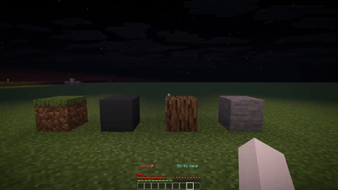

<div align="center">


# Mint

🍃 **A Lovingly Crafted Quality of Life Extension** — Quark-style tweaks for Paper and Folia. 🍃


</div>

Mint provides 20+ lightweight, vanilla-friendly gameplay tweaks. It features per-player toggles, WorldGuard/GriefPrevention integration, multiple storage backends, and requires zero client-side mods.

## Features

**Building & Placement**

- **Vertical & Mixed Slabs:** Place slabs vertically, or combine two different slab types in one block space.

  <details>
  <summary>View Demo</summary>

  

  

  </details>

- **Block Decoration:** Apply decorative skins to various blocks (fences, stairs, trapdoors, pots, etc.).

  <details>
  <summary>View Demo</summary>

  

  </details>

- **Carpet Geometry:** Craft geometric carpet patterns via the stonecutter.

  <details>
  <summary>View Demo</summary>

  

  </details>

- **Ladder Place:** Quickly place ladders above/below your current position.

  <details>
  <summary>View Demo</summary>

  

  </details>

**Movement & Transportation**

- **Bedrock Bridging:** Placement preview and godbridge mode.

  <details>
  <summary>View Demo</summary>

  

  </details>

- **Fast Ladders & Sprint Retention:** Climb smoother and keep momentum after stopping.
- **Vehicles:** Smoother boat handling, faster minecarts, and chain-linkable carts.
- **Chicken Glide:** Carry chickens for a slow-falling glide effect.

  <details>
  <summary>View Demo</summary>

  

  </details>

**Interaction & Convenience**

- **Inventory & Tools:** Shift-right-click to sort containers, Auto-Tool selection, and Auto-Refill for hotbars.

  <details>
  <summary>View Demo</summary>

  

  </details>

- **Doors:** Double doors open together, left-click to knock.
- **Slab Breaker:** Break exactly one half of a double slab.

  <details>
  <summary>View Demo</summary>

  

  </details>

**Aesthetics**

- **Frames & Paintings:** Toggle item frame visibility with shears; scroll through painting variants.
- **Leash Decoration:** Link fences with leads and swing from them.

## Installation

1. Download the latest `Mint-1.0.0.jar` from [Releases](https://github.com/BuddySirJava/Mint/releases).
2. Drop it into your `plugins/` folder and restart.
3. Configure settings via `plugins/Mint/config.yml`.

**Requirements:** Paper 1.21.4+, Java 17+.

*Upgrading from the legacy plugin?* Move your old configs to `plugins/Mint/`. Permissions and placeholders now use the `mint` prefix, e.g. `%mint_modules_total%`.

## Commands & Permissions

| Command                             | Description              | Permission                  |
| ----------------------------------- | ------------------------ | --------------------------- |
| `/mint`                             | Open personal module GUI | `mint.gui` (Default: true)  |
| `/mint help` / `about`              | Standard info commands   | -                           |
| `/mint admin reload`                | Reload configuration     | `mint.admin`, `mint.reload` |
| `/mint admin modules`               | List all module states   | `mint.admin`                |
| `/mint admin toggle <mod> [player]` | Toggle a module          | `mint.admin`, `mint.toggle` |
| `/mint admin global <mod> <on/off>` | Globally toggle a module | `mint.admin.global`         |
| `/mint admin save`                  | Save config to disk      | `mint.reload`               |

*Bypass region protections using `mint.bypass.protection`.*

## Technical Details

- **Storage:** Supports YAML (default), H2, MySQL, MariaDB, and MongoDB.
- **Performance:** Fully Folia-compatible and multi-threaded.
- **Protection:** Automatically respects WorldGuard and GriefPrevention build permissions.
- **Customization:** Full GUI and message customization via `gui.yml` and `lang.yml` (MiniMessage supported).

## Building from Source
```bash
git clone https://github.com/BuddySirJava/Mint.git
cd Mint
mvn clean package
```
## License & Credits

Licensed under [GPLv3](LICENSE). Inspired by the [Quark mod](https://quarkmod.net/) by Vazkii. See [CONTRIBUTING.md](CONTRIBUTING.md) to contribute.
`