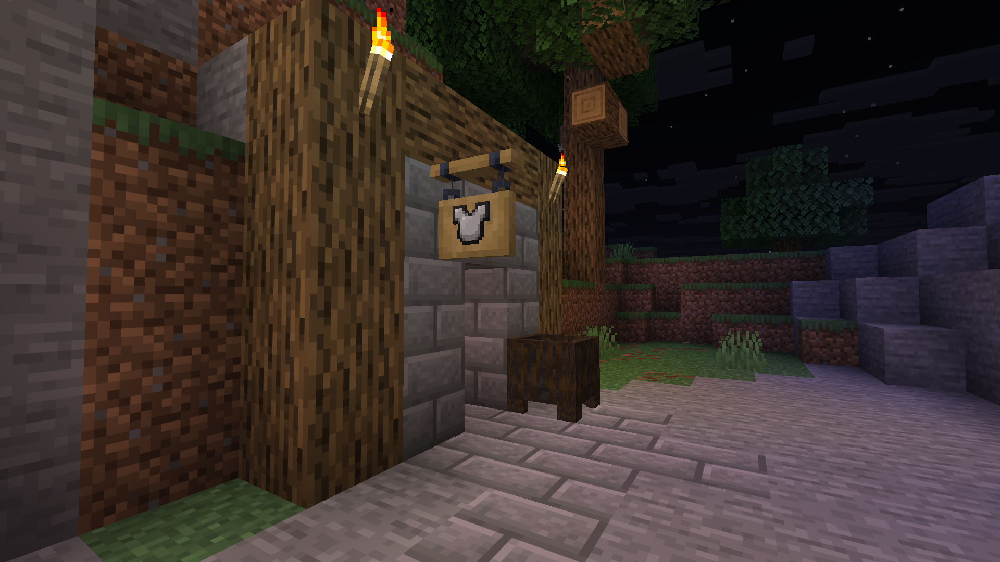
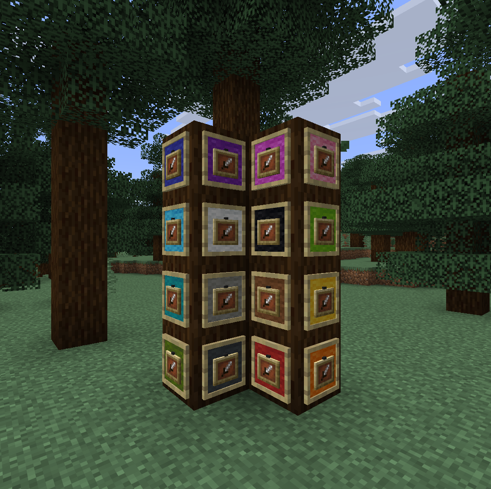

# Building Modules

These modules focus on placement, decoration, and building convenience.

## Reacharound Placement
- **Config key:** `modules.reacharound-placement`
- **Description:** Allows Quark-style reacharound placement when normal targeting misses.
- **Permission node:** `mint.module.reacharound-placement` (default; override with `modules.reacharound-placement.permission`)

## Block Decoration
- **Config key:** `modules.blockdecoration`
- **Description:** Decorates supported blocks with display skins.
- **Permission node:** `mint.module.blockdecoration` (default; override with `modules.blockdecoration.permission`)
- **Preview:** `media/modules/block-decoration.gif`

## Carpet Geometry
- **Config key:** `modules.carpetgeometry`
- **Description:** Uses a stonecutter to craft geometric patterns into carpets.
- **Permission node:** `mint.module.carpetgeometry` (default; override with `modules.carpetgeometry.permission`)
- **Preview:** `media/modules/carpet-geometry.gif`

## Ladder Place
- **Config key:** `modules.ladder-place`
- **Description:** Places ladders quickly above or below your current position.
- **Permission node:** `mint.module.ladder-place` (default; override with `modules.ladder-place.permission`)
- **Preview:** `media/modules/fast-ladder.gif`

## Sign Items
- **Config key:** `modules.sign-items`
- **Description:** Places items on hanging signs using display entities.
- **Permission node:** `mint.module.sign-items` (default; override with `modules.sign-items.permission`)
- **Preview:** `media/modules/signitems.png`

## Slab Breaker
- **Config key:** `modules.slab-breaker`
- **Description:** Breaks only one half of double slabs.
- **Permission node:** `mint.module.slab-breaker` (default; override with `modules.slab-breaker.permission`)
- **Preview:** `media/modules/slab-breaker.gif`

## Mixed Slab
- **Config key:** `modules.mixedslab`
- **Description:** Places two different slab types in one block space.
- **Permission node:** `mint.module.mixedslab` (default; override with `modules.mixedslab.permission`)
- **Preview:** `media/modules/mixed-slab.gif`

## Vertical Slab
- **Config key:** `modules.verticalslab`
- **Description:** Enables vertical slab placement visuals.
- **Permission node:** `mint.module.verticalslab` (default; override with `modules.verticalslab.permission`)
- **Preview:** `media/modules/vertical-slab.gif`

## Dyeable Item Frames
- **Config key:** `modules.dyeable-item-frames`
- **Description:** Dyes item frames using mixed dye combinations with a wool-style texture overlay.
- **Permission node:** `mint.module.dyeable-item-frames` (default; override with `modules.dyeable-item-frames.permission`)
- **Preview:** `media/modules/itemframes.png`

